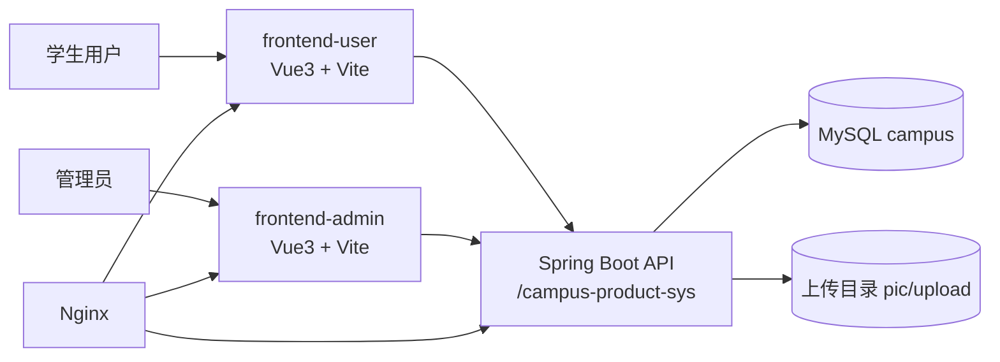

# 系统现状图与模块映射（论文第 3 章素材）

## 1. 系统分层图

## 2. 新版前端路由现状

### 学生端（`frontend-user/src/router/index.ts`）
- 已实现：`/login`、`/register`、`/`、`/my/orders`、`/my/profile`
- 占位页较多：分类、搜索、发布、收藏、聊天、校园认证等

### 管理端（`frontend-admin/src/router/index.ts`）
- 已实现：`/login`、`/dashboard`
- 占位页较多：用户管理、商品审核、举报处理、公告管理、统计等

## 3. 核心模块映射（页面 ↔ API ↔ 后端）

| 页面/模块 | 前端 API | Controller | Service | 关联表 |
|---|---|---|---|---|
| 学生登录 | `/user/login`, `/user/auth` | `UserController` | `UserServiceImpl` | `user` |
| 商品浏览 | `/product/query` | `ProductController` | `ProductServiceImpl` | `product`, `category`, `interaction` |
| 商品发布 | `/product/save` | `ProductController` | `ProductServiceImpl` | `product` |
| 预约下单 | `/product/buyProduct` | `ProductController` | `ProductServiceImpl` | `orders`, `product` |
| 卖家确认预约 | `/product/placeAnOrder/{id}` | `ProductController` | `ProductServiceImpl` | `orders`, `product` |
| 双方确认完成 | `/product/getGoods/{id}`, `/product/confirmTradeBySeller/{id}` | `ProductController` | `ProductServiceImpl` | `orders`, `product` |
| 预约取消 | `/product/refund/{id}` | `ProductController` | `ProductServiceImpl` | `orders`, `product` |
| 管理统计 | `/dashboard/staticCount` | `DashboardController` | `DashboardServiceImpl` | 多表聚合 |
| 操作日志 | `/operation-log/query` | `OperationLogController` | `OperationLogServiceImpl` | `operation_log` |

## 4. 可运行性证据结论
- 前端三套工程构建通过。
- admin 与 legacy 有大包告警，适合写入性能优化章节。
- 后端本机无法执行 Maven（无 `mvn`），已补 CI 方案用于编译验证。
